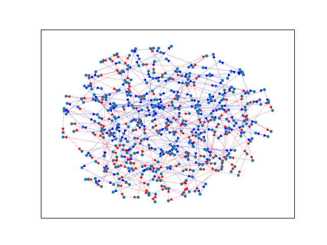

# Hashcode 2021

## Further Investigations
The dataset that gave us the most trouble was D. 
We were about 600,000 points short of the average solution, which was the largest gap of any of the datasets.

To try to get some insight into the dataset we did a few things. First we looked at the histogram of route lengths
using `np.histogram(routeLengths)`. The results are shown below:

```
(array([     0,      0,      0,      0,      0, 200000,      0,      0,      0,      0], dtype=int64), 
  array([199.5,  199.6,  199.7,  199.8,  199.9,   200.,  200.1,  200.2,  200.3,  200.4, 200.5]))
```

This quickly showed us one feature of this dataset: all the paths were of length 200.

We then plotted 2 random car routes to see if there was any sort of patterns



From this plot we still don't see any obvious patterns. This means that the most probable aspect for this dataset
to be focusing on is street cost. Our current algorithm didn't take this into account, weighting only on intersection load.